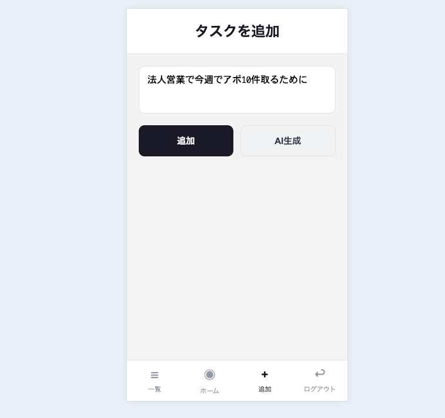

# Swipe Todo

Tinder風スワイプUIのタスク管理PWAアプリ

**デモ**: https://pwa-tinder-todo.vercel.app

## スクリーンショット

<p align="center">
  
  
  
</p>

## 特徴

- **スワイプでタスク管理** - Tinder風UIで直感的に操作
- **GitHub Issues連携** - タスクはGitHub Issuesに保存
- **AI生成** - Claude APIでタスクを自動生成（任意）
- **PWA対応** - ホーム画面に追加可能

## スワイプ操作

| 方向 | アクション |
|:----:|-----------|
| ← | スキップ（後回し） |
| → | 進行中 |
| ↑ | 完了 |
| ↓ | アーカイブ |

## セットアップ

### 1. GitHubリポジトリを作成

タスク管理用のリポジトリを作成（空でOK）

### 2. Personal Access Token (PAT) を発行

1. GitHub → Settings → Developer settings
2. Personal access tokens → Tokens (classic)
3. Generate new token → 「repo」スコープにチェック

### 3. ログイン


- **GitHub PAT**: 発行したトークン
- **リポジトリ**: `https://github.com/username/repo` 形式でOK
- **Claude API Key**: AI生成を使う場合のみ（任意）

> 認証情報はsessionStorageに保存されます。タブを閉じると消えます。

## 技術スタック

React / TypeScript / Vite / framer-motion / GitHub Issues API / Vercel

## 開発

```bash
npm install
npm run dev
```
